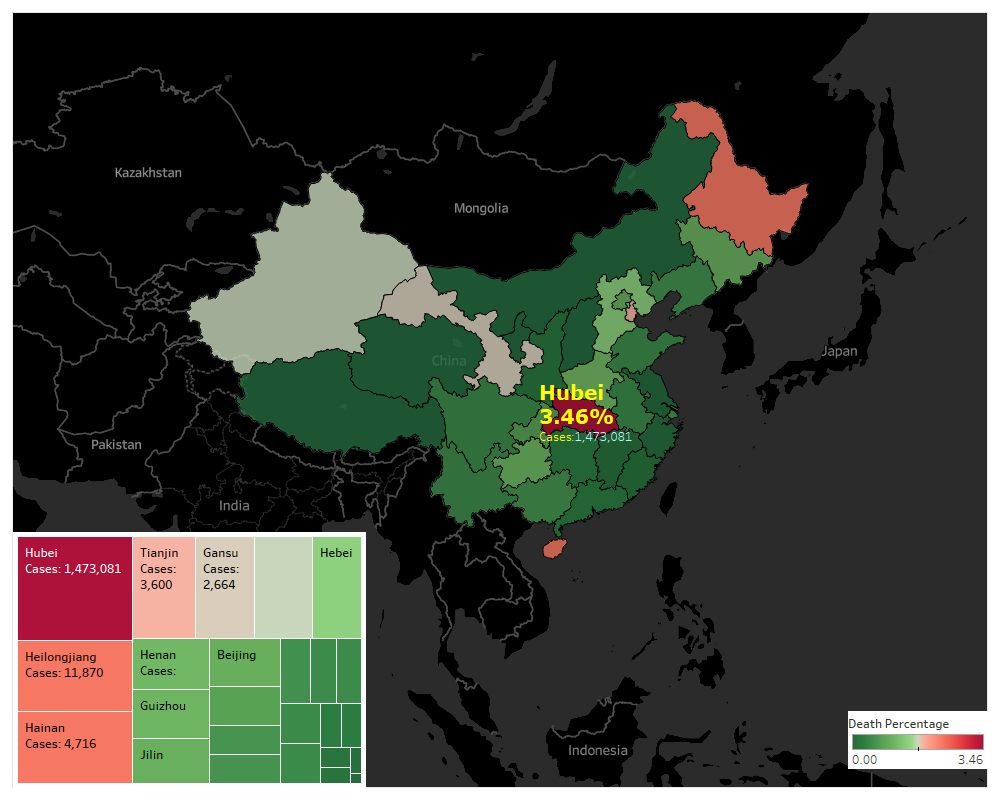

# Corona-Virus-Analysis
Analysing Corona Virus data using data visualizations on Tableau.

data source: https://bit.ly/3axnxBd

## In China
### Percentage Recovery 
Data shows that even states closer to the epicenter of virus origin are recovering quickly but those far away have lower percentages. On further analysis I found out that this behaviour is due to difference in number of people affected.
- States with high number of confirmed cases tend to have low recovery percentage

### Death Percentage Analysis
Data shows that Hubei has the highest death percentage. States closer to the epicenter of virus origin have low death percentage but a few far away have high death percentage.
We can conclude that:
- States with greater number of confirmed cases tend to have high death percentage
- CONVID19 can become deadly if it effects more and more people

